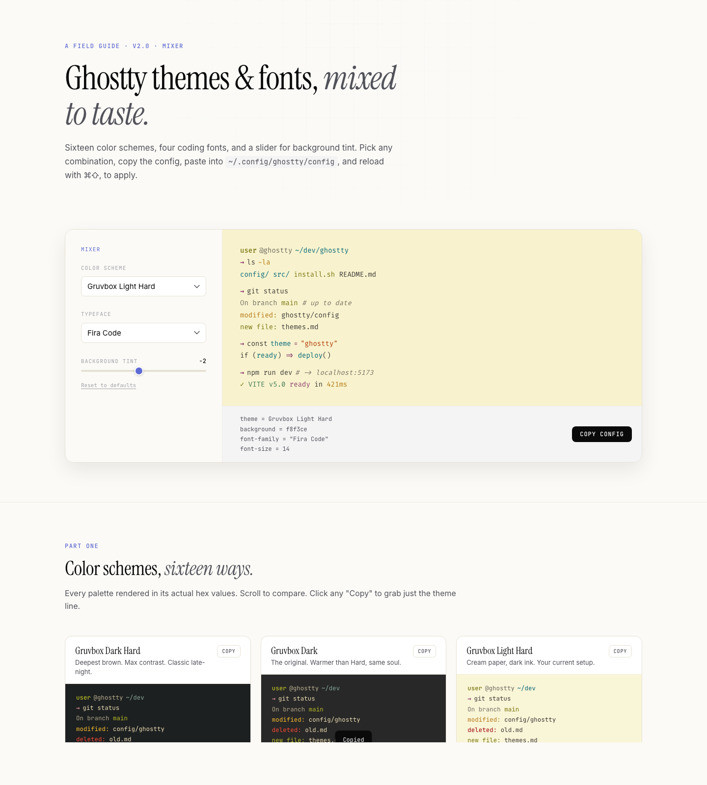

# Ghostty Theme Mixer

Live theme & font mixer for the [Ghostty](https://ghostty.org) terminal. Preview 16 color schemes and 4 coding fonts, nudge the background tint, and copy a ready-to-paste config in one click.

**→ [Try it live at ghosttythemes.com](https://ghosttythemes.com)**



## What's in it

- **16 themes** — four Gruvbox variants, Tokyo Night (+ Storm), Catppuccin (Mocha + Latte), Nord, Dracula, Rosé Pine, Solarized (Dark + Light), Kanagawa, Everforest, GitHub Dark
- **4 typefaces** — Fira Code, JetBrains Mono, IBM Plex Mono, Geist Mono
- **Background tint slider** — nudge any theme's background lighter or darker without losing the palette
- **One-click config** — copy the exact lines you need for `~/.config/ghostty/config`

## Apply your mix

1. Pick theme + font + tint in the mixer
2. Click **Copy command**
3. Paste the command into any terminal (Ghostty included) and hit enter — it appends to `~/.config/ghostty/config`
4. Reload Ghostty with `⌘ ⇧ ,` — change is instant, no restart

If a theme name isn't recognised by your Ghostty version, run `ghostty +list-themes | grep -i <name>` to find the exact spelling.

## Kept in sync with Ghostty

Theme keys in the mixer are verified **weekly** against [iTerm2-Color-Schemes/ghostty](https://github.com/mbadolato/iTerm2-Color-Schemes/tree/master/ghostty) — the upstream source Ghostty bundles its themes from. If a theme is ever renamed or removed upstream, a GitHub issue is opened automatically (see [`.github/workflows/check-themes.yml`](.github/workflows/check-themes.yml)) so the mixer stays in lockstep with whatever you have installed.

## FAQ & tips

**My new theme didn't apply — what happened?**
The most common cause is not reloading Ghostty. After pasting the command, hit `⌘ ⇧ ,` _inside a Ghostty window_ to re-read the config. Opening a new window (`⌘ N`) also picks up the latest config.

**The text colors changed but the background stayed the same.**
You probably had a previous mixer run with the tint slider active, which set an explicit `background = ...` override. The gallery cards below the mixer now emit the theme's default background alongside `theme = ...` so the full palette flips — make sure you're on the latest site (hard-refresh with `⌘ ⇧ R`).

**My config file is getting cluttered with repeated `# ghostty-theme-mixer` blocks.**
Purely cosmetic — Ghostty resolves duplicates by "last wins," so everything works correctly. If you want a clean slate, wipe every mixer-added line with:

```bash
sed -i.bak -E '/^# ghostty-theme-mixer$|^(theme|background|font-family|font-size) *=/d' ~/.config/ghostty/config && rm -f ~/.config/ghostty/config.bak
```

Then re-apply whichever theme you want from the mixer.

**I pasted the command somewhere it shouldn't have gone and now Ghostty errors on startup.**
If a `mkdir ...` line ended up inside your config file (e.g., you pasted into a text editor instead of a live terminal), strip it out:

```bash
sed -i.bak '/^mkdir /d' ~/.config/ghostty/config && rm -f ~/.config/ghostty/config.bak
```

**A theme name from the mixer isn't recognised by my Ghostty.**
Shouldn't happen — all 16 keys are verified weekly against upstream (see section above). But if it ever does, find the real spelling with `ghostty +list-themes | grep -i <name>` and [open an issue](../../issues) so it gets fixed.

**Where is Ghostty's config file?**
`~/.config/ghostty/config` on both macOS and Linux. All mixer commands target this path.

## Local development

It's a single static HTML file — no build step.

```bash
git clone https://github.com/mcvalosborne/ghostty-theme-mixer.git
cd ghostty-theme-mixer
open index.html
```

## License

MIT
